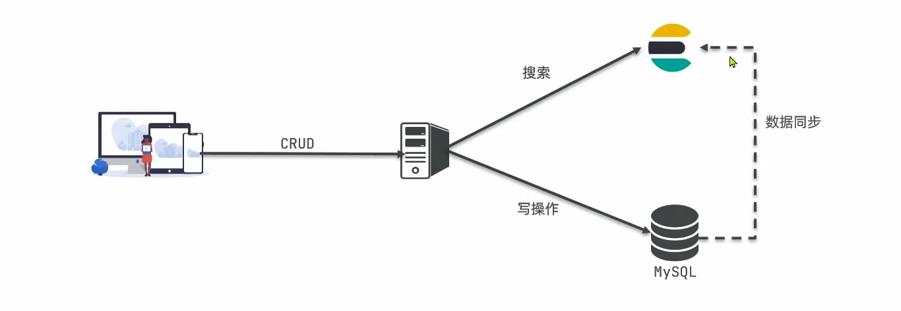

# ES和MySQL
## 使用场景的比较：
1. MySQL更擅长的是事务类型的操作，可以确保数据的安全和一致性；如果是有事务要求，如商品的下单支付等业务操作，无疑使用MySQL。
2. ES更擅长的是海量数据的搜索，分析和计算；如果是复杂搜索，无疑可以使用Elasticsearch。
3. 两者是一个互补而不是替代的关系。



```

```

## 二者优势
- MySQL：擅长事务类型操作，可以确保数据的安全和一致性；
- ElasticSearch：擅长海量数据的搜索、分析、计算；


## 常用命令
```json
// 查询
GET collectibles_period_per_minutes_1440/_search
{
  "query": {
    "match_all": {}
  },
  "sort": [
    {
      "created_at": {
        "order": "desc"
      }
    }
  ],
  "size":30
}
``` 

